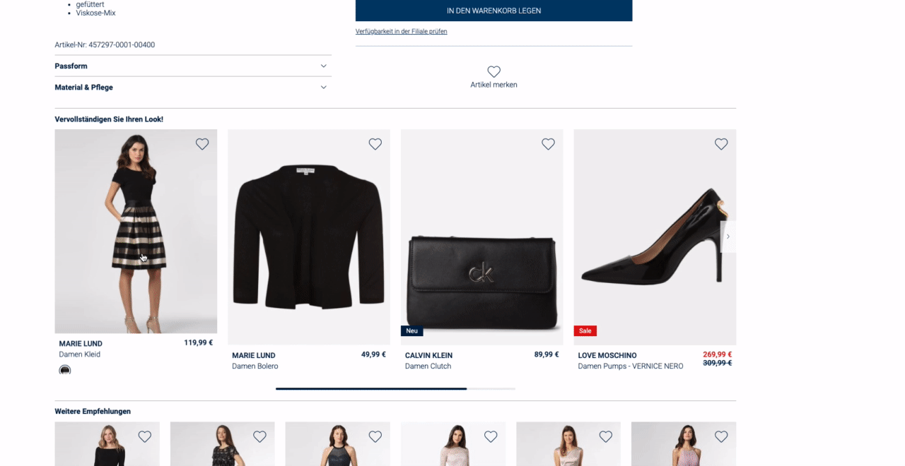

# User adds a product to their card from within 8.SET content

Let's assume you are showing content from 8.SET that was loaded via [8.API](../../../api/examples/8.set.md). Whenever a user adds a product from within that content to their cart you should send the respective `interact` event.



Suppose you requested content for product with SKU `457297-0001-00340`the API would return this:

```javascript
{
  "data": {
    "product": {
      "matchingProductClusters": {
        "edges": [
          {
            "node": {
              ...
            }
          },
          {
            "node": {
              "products": {
                "edges": [
                  {
                    "node": {
                      "id": "379217-0006"
                    }
                  },
                  ...
                ]
              }
            }
          },
          ...
        ]
      }
    }
  }
}
```

The event you send would look like that:

```javascript
{
  "type": "interact",
  "interact": {
    "action": "addToCart",
    "type": "product",
    "product": {
      "sku": "379217-0006"
    }
  },
  "context": [
    {
      "content": {
        "matchingProductClusters": {
          "id": "457297-0001-00340"
        },
        "type": "matchingProductClusters"
      },
      "type": "content"
    },
    {
      "type": "user",
      "user": {
        "id": "c57a43f7-eefc-462b-b5a8-0ef421e90f67"
      }
    }
  ]
}
```

The type of the event is `interact`. The corresponding `interact` property is intended to specify the action and target of the event. In our case, this would be `addToCart` and  `product`. Again, to describe the target more specifically, we include the `id` of the product interacted with — as returned in the API response.

Lastly, the `context` must contain an object with type `user`, as well as the `content` context specifying the type of content and the id as described in the [context](../../general/context.md) section.
