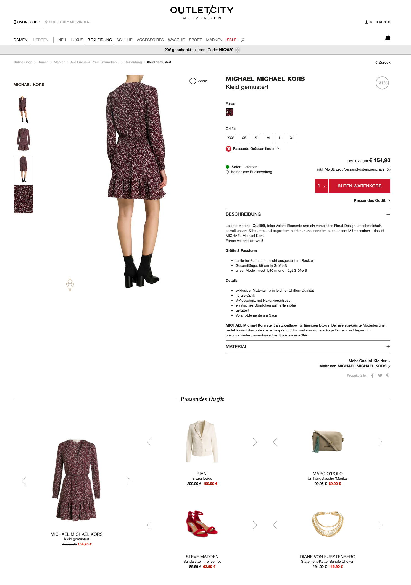
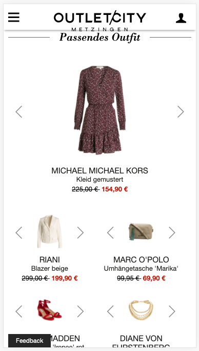

# 8.SET Compose

## Beispiel

### Desktop



### Mobile



## Widget-Element

### Passendes Product-Set für eine SKU

```markup
<div data-8select-widget-id="sys-psv" data-sku="42"></div>
```

`data-sku` ist die SKU des aktuellen Artikels. Die CSE sucht basierend darauf ein Produktset welches diesen Artikel enthält. Der Wert für `data-sku` muss dynamisch gesetzt werden und muss einer der im [Produktexport]() übergebenen SKU entsprechen.

### Ein bestimmtes Product-Set

```markup
<div data-8select-widget-id="psp-psv" data-set-id="65b1169b-12a7-46a2-a9c0-6561861cbca5"></div>
```

`data-set-id` definiert welches Produktset angezeigt werden soll. Den Wert für `data-set-id` entnehmen Sie bitte der Management-Console.

## API

### Über SKU Wechsel informieren

Wenn Ihr Shop Varianten via Ajax nachlädt, so müssen Sie das SYS-PSV Widget über die geänderte SKU informieren.

```javascript
window._8select.reinitSys('<neue-sku>')
```

### Callback wenn für SKU ein Product-Set \(nicht\) gefunden

Im Erfolgs- bzw. Fehlerfall wird `window._eightselect_config.sys.callback` aufgerufen sofern eine Funktion definiert ist.

**Beispiel**

```text
window._eightselect_config = window._eightselect_config || {}
window._eightselect_config['sys'] = {
  callback: function (error, sku, widgetUuid) {
    if (error) {
      // something went wrong or no set was found for given sku
      return
    }
    // everything fine and a set was found for given sku
    // we can show a button that let's the customer know that we have a set and allows him/her to navigate to the widget with one click
    document.querySelector('[data-8select-widget-id=sys-psv-button]').style.display = 'block'
  }
}
```

