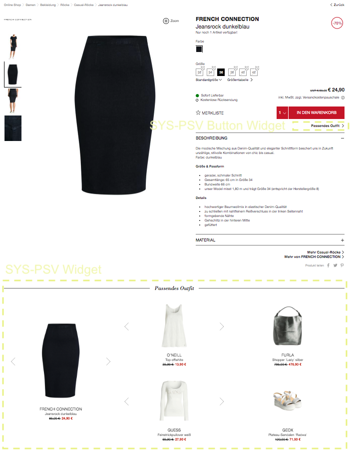

# sys-psv-button



Der SYS-PSV-Button weißt den Nutzer der Webseite darauf hin, dass es zum aktuell angesehenen Artikel ein passendes Produktset gibt.  
Der Nutzer kann mit einem Klick auf den Button direkt zum Produktset runterscrollen oder springen.

Ein beliebiges Element mit dem Attribut `data-8select-widget-id="sys-psv-button"` wird als SYS-PSV Button erkannt. Dieses Element sollte initial versteckt sein. Ist ein Produktset zum Artikel verfügbar, wird der Button automatisch eingeblendet.

**Beispiel**

HTML im Quellcode:

```markup
<button
    data-8select-widget-id="sys-psv-button"
    onclick="_8select.utils.goToWidget(document.querySelectorAll('[data-8select-widget-id=sys-psv]')[0].getAttribute('data-8select-widget-uuid'), 0);"
    ontouchend="_8select.utils.goToWidget(document.querySelectorAll('[data-8select-widget-id=sys-psv]')[0].getAttribute('data-8select-widget-uuid'), 0);"
    type="submit"
    style="display: none;"
  >Passender Look</button>
```

**Asynchrone Einbindung**

Für den Fall, dass das SYS-PSV-Button-Element dynamisch erzeugt oder asynchron geladen wird, muss im Zuge dessen folgender JavaScript-Callback ausgeführt werden:

```javascript
if (typeof _8select === "undefined") {
  return
}
_8select.utils.showSysButton()
```

