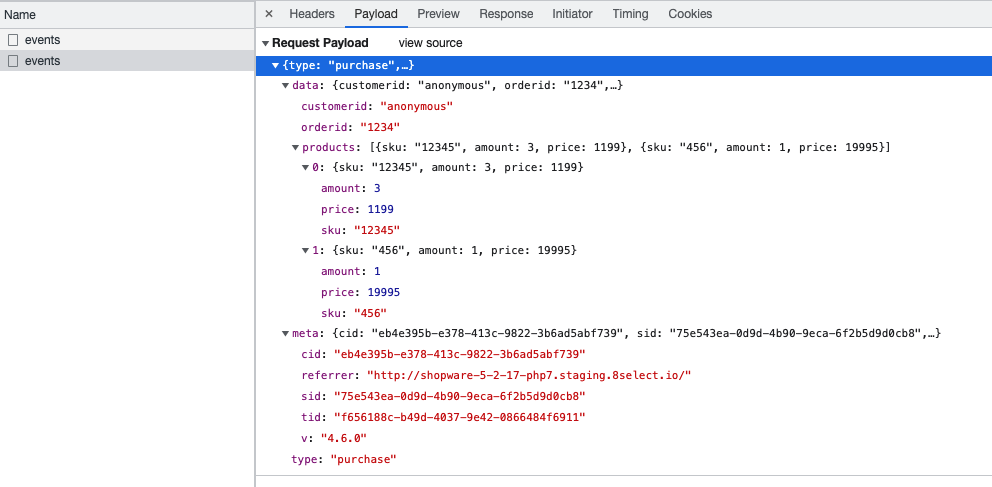

# Checkout

The commission is based on performance, i.e. only products purchased via our widgets are eligible for commission. To determine these products, the purchases in the shop are compared with the interactions in our widgets. For this purpose, all shop transactions must be transmitted. The transmission takes place without personal data and only contains the individual order items.


To simplify the commission process it is based on **gross prices**, i.e. you have to transfer the **gross price** of a product.


### Code

```javascript
// 8.SDK Web
<script type="text/javascript">
    ...
</script>


// 8.LYTICS tracking for commission based pricing
<script type="text/javascript">
  window.eightlytics(
    'purchase',
      {
        customerid: 'anonymous', // string
        orderid: '1234', // string - unique
        products: [
          {
            sku: '12345', // string
            amount: 3, // integer
            price: 1199 // integer - gross price of 1 item in cent
          },
          {
            sku: '456', // string
            amount: 1, // integer
            price: 19995 // integer
          }
        ]
    }  
  );
</script>
```

### How it will look in chrome's network tab

There should be a POST request going out to `https://eltx.8select.io/events`



### Hints to consider


For **`price`**, the price in cents per item must be transferred as an **`integer`**.\
For an item that costs 199.95 €, the value `19995` must be transferred.&#x20;



For **sku**, the same value as in the [product export](../product-export/stammdaten/details.md#sku-sku) must be used. The value must be transmitted as a **string**.



The **customerid** will be used to optimize content in the future. For the sake of simplicity and GDPR concerns we are removing it for now as a requirement. In the meantime just transfer `anonymous` as value.



The **orderid has to be unique** because we use it to deduplicate orders.

The **orderid** is used to compare our analytics data with the shop's analytics data on request. For example, for spot checks. If this is desired, the orderid must not be transmitted anonymously.

