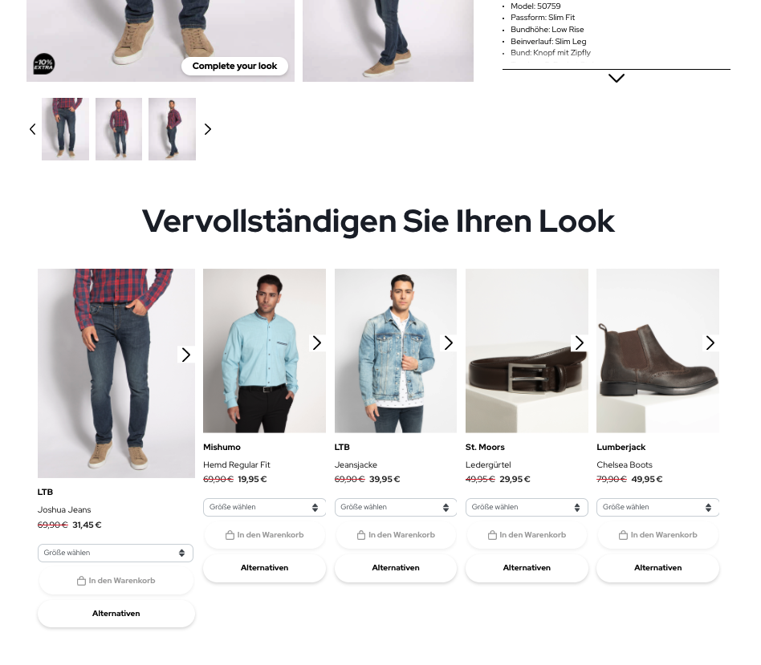

# 8.SET - on product page



## Widget-Element

### **Show product set by SKU or Main-SKU**

```markup
<div data-8select-widget-id="8.SET-Compose" data-sku="42"></div>
```

* `data-sku` is a dynamic attribute
  * its value is the [SKU](../product-export/base-data/details.md#sku-sku) or [Main-SKU](../product-export/base-data/details.md#main-sku-main-sku) of the product variant the customer is viewing in the shop
  * the [SKU](../product-export/base-data/details.md#sku-sku) or [Main-SKU](../product-export/base-data/details.md#main-sku-main-sku) has to be the same value that is used in the [product export](../integration/produkt-export.md)


The 8SELECT integration team will adjust the widget styling 🎨 to your shop design. ❤️&#x20;


#### Update SKU in case of non-size variant change


The played out content is specific to visual variants such as colour or pattern. When the visual variant changes the widget has to be updated!


The played out content is specific to visual variants such as colour or pattern. \
To retrieve the content of the currently selected visual variant, the current SKU must be passed to the widget when the visual variant is changed. For example if a customer is currently viewing the red variant of a shirt and changes to the blue variant, the 8.SDK has to be informed about the changed SKU to load content for the changed visual variant.\
\
This must not happen when changing the size, as the content is size-independent.

#### Update SKU via API call

Currently not supported anymore.

#### Other options

If the widget HTML itself is removed from the DOM on variant change and just added again with the new SKU the SDK has to scan the DOM again. So please call `window._8select.initCSE()`
