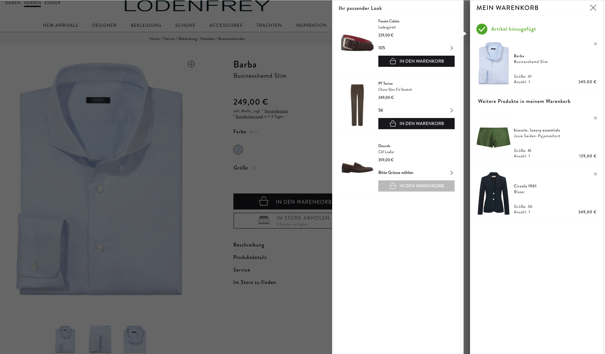

# 8.SET  - on cart layer

 

## Widget-Element <a href="#widget-element" id="widget-element"></a>

**Show matching product set for a given SKU or Main-SKU**

```markup
<div data-8select-widget-id="8.SET-Flat" data-sku="42"></div>
```

* `data-sku` is a dynamic attribute
  * its value is the [SKU](../product-export/base-data/details.md#sku-sku) or [Main-SKU](../product-export/base-data/details.md#main-sku-main-sku) of the product variant the customer is viewing in the shop
  * the [SKU](../product-export/base-data/details.md#sku-sku) or [Main-SKU](../product-export/base-data/details.md#main-sku-main-sku) has to be the same value that is used in the [product export](../integration/produkt-export.md)


The 8SELECT integration team will adjust the widget styling 🎨 to your shop design. ❤️&#x20;


### Dynamic widget

You can add the 8.SET Flat widget to the DOM before your modal is even shown or you can add it when your modal is shown. To save requests and bandwidth for your users, you should only add the widget when it is actually on the viewport. The 8.SDK is probably already loaded by then, so you need to call `window._8select.initCSE()` to notify the 8.SDK about the new widget.

To also be on the safe side in case something went wrong when loading our SDK you probably should do something like this:

```javascript
if (window._8select && typeof window._8select.initCSE === 'function') {
  window._8select.initCSE();
}
```


The 8.SDK is probably already loaded when you add 8.SET Flat, so you need to call `window._8select.initCSE()`to notify the 8.SDK about the new widget.


