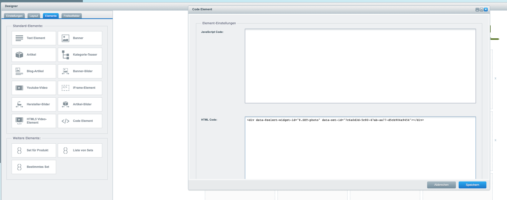
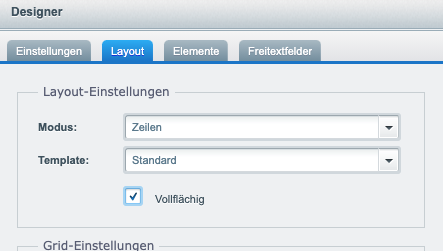

# 8.SET Photo

<div align="center">


</div>


## Widget-Element

```markup
<div data-8select-widget-id="8.SET-photo" data-set-id="de5d6599-56f9-4b13-abfd-3e18ef75f95b"></div>
```

* `data-set-id` is a static or dynamic value
  * its value is the id of the photo set
  * you can find the ids inside 8.CONTROL 2.0 (Photo Set Manager)


The 8SELECT integration team will adjust the widget styling 🎨 to your shop design. ❤️&#x20;


### Landing page with dynamic data-set-id

The common integration pattern is to use one landing page where the 8.SET Photo widget is added and onsite elements to link to that page.\
The `data-set-id` value is set dynamically via the URL parameter `setId`.\
\
**Example URL**\
https://demo.8select.io/shop-the-look?setId=a72f398f-9dc8-4712-8ba8-b33a63717b17

## Shopping cart

For the shopping cart function, a JavaScript function must be made available as described in the [SHOP INTEGRATION - Shopping Cart ](../integration/warenkorb.md)section.

## Shopware example integration

An integration in Shopware can be done, for example, via the shopping worlds. For this, the widget element is simply inserted via a code element as described above. Here, too, the `data-set-id` can either be static or set dynamically with the help of the URL parameter `setId`.







You can use our Shopware Plugin for easy integration.



